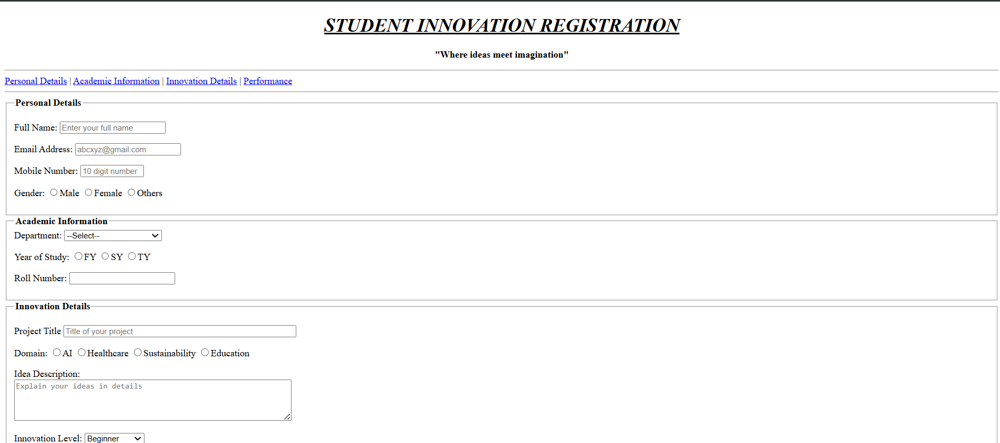
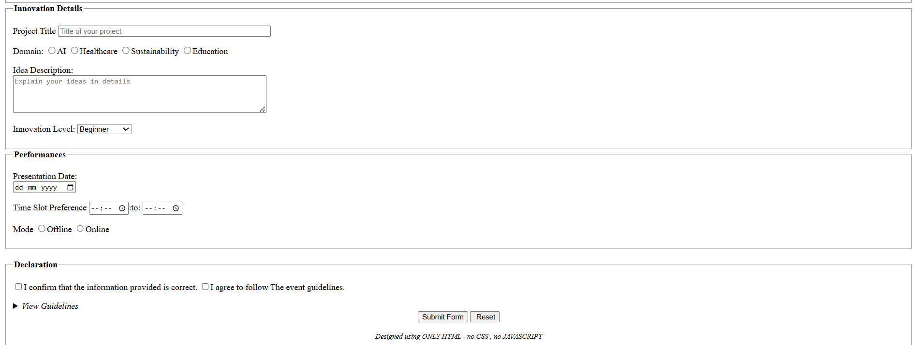

# Student Innovation Registration Form

## Description

The Student Innovation Registration Form is a beginner-level HTML project designed to collect student details and innovation project information for an innovation event. The form includes personal details, academic information, project details, presentation preferences, and participant declarations.

## Features

* Personal Details Section
* Academic Information Section
* Innovation Details Section
* Performance & Presentation Scheduling
* Event Guidelines Section
* Form Validation using HTML attributes
* Internal Navigation Links
* Radio Buttons, Checkboxes, Dropdowns, and Text Areas
* Built using only HTML

## Technologies Used

* HTML5

## Website Preview

## Form Sections

### Personal Details

* Full Name
* Email Address
* Mobile Number
* Gender

### Academic Information

* Department Selection
* Year of Study
* Roll Number

### Innovation Details

* Project Title
* Domain Selection
* Idea Description
* Innovation Level

### Performance Details

* Presentation Date
* Time Slot Preference
* Presentation Mode

### Declaration

* Confirmation Checkbox
* Event Guidelines

## How to Run

1. Download or clone the repository.
2. Open `index.html` in any web browser.
3. Fill out the form and explore its features.

## Learning Outcomes

* Understanding HTML Forms
* Using Fieldsets and Legends
* Creating Internal Page Navigation
* Working with Input Types

